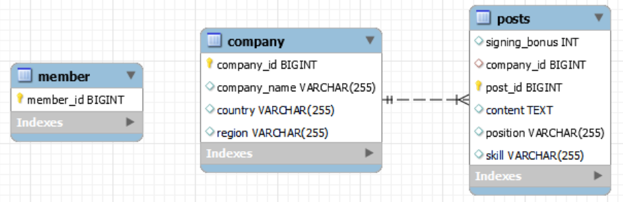

# Wanted-pre-onboarding-backend
> 아래 서비스 개요 및 요구사항을 만족하는 API 서버를 구현한다.

## 1. 서비스 개요
- 본 서비스는 기업의 채용을 위한 웹 서비스 입니다.
- 회사는 채용공고를 생성하고, 이에 사용자는 지원합니다.

## 2. 요구사항 분석
- 회사, 사용자 등록 절차는 생략합니다. (DB에 임의로 생성하여 진행)
- 로그인 등 사용자 인증절차(토큰 등)는 생략합니다.

### 2-1. 🗂️ 주요 기능
> 필수 구현 기능 : 1, 2, 3, 4-1   
> 선택사항 및 가산점 : 4-2, 5, 6

1. 회사는 **채용공고를 등록**한다.
2. 회사는 **채용공고를 수정**한다.
3. DB에서 **채용공고를 삭제**한다.
4. 채용공고 목록 가져오기  
  4-1. 사용자는 **채용공고 목록 전체를 조회**할 수 있다.  
  4-2. 사용자는 **채용공고를 검색**할 수 있다. 
   1. ex) 회사명 or 채용포지션
5. 사용자는 **채용공고 상세 페이지를 확인**할 수 있다.
   1. "채용내용"이 추가적으로 담겨있음
   2. 해당 회사가 올린 다른 채용공고 가 추가적으로 포함됨
6. 사용자는 **채용공고를 지원**한다.
   1. 사용자는 1회만 지원 가능함

### 2-2. 🏠 모델
- 회사
- 사용자 
- 채용공고 
- 지원내역(선택사항)

이외 추가 모델정의 자유

## 3. 개발 환경
- 언어 : Java 17
- 프레임워크 : Spring Boot 3.2.8
  - 빌드 관리 도구 : Gradle 8.8 - Groovy
  - Packaging : Jar
- ORM : Spring Data JPA
- DB : MySQL 8.0.29
- [build.gradle 파일](build.gradle)

## 4. ERD
 

## 5. API 명세서
###[노션 링크 (각 기능별로 실행 사진이 첨부되어있음)](https://jinhui-portfolio.notion.site/API-90e049d731e44579aa35f96eb38c78a9?pvs=4)

| 완료  | Method | 기능                     | URI                              |
|:---:|:------:|:-----------------------|:---------------------------------|
|  ✅  |  POST  | 1. 채용공고 등록             | /posts                           |
|  ✅  | PATCH  | 2. 채용공고 수정             | /posts/{id}                      |
|  ✅  | DELETE | 3. 채용공고 삭제             | /posts/{id}                      |
|  ✅  |  GET   | 4-1. 채용공고 목록 전체 조회     | /posts                           |
|  ✅  |  GET   | 4-2. 채용공고 검색 (채용포지션으로) | /posts/search?position={keyword} |
|  -  |  GET   | 5. 채용공고 상세 페이지 확인      | -                                |
|  -  |  POST  | 6. 채용공고 지원             | -                                |
